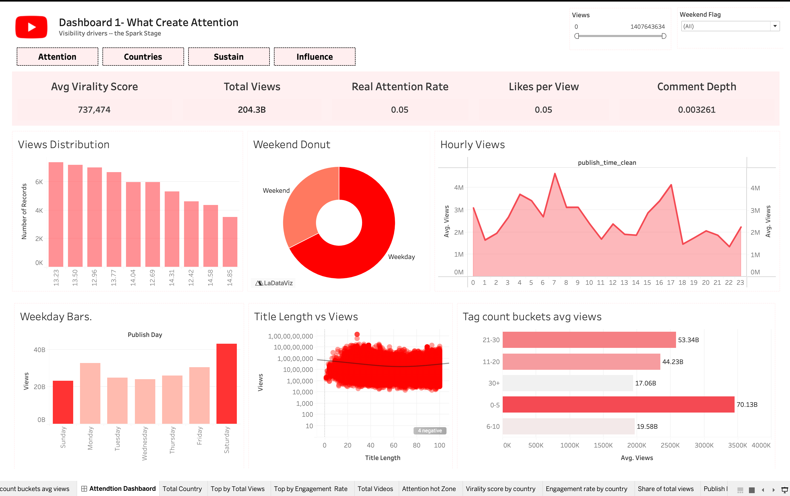
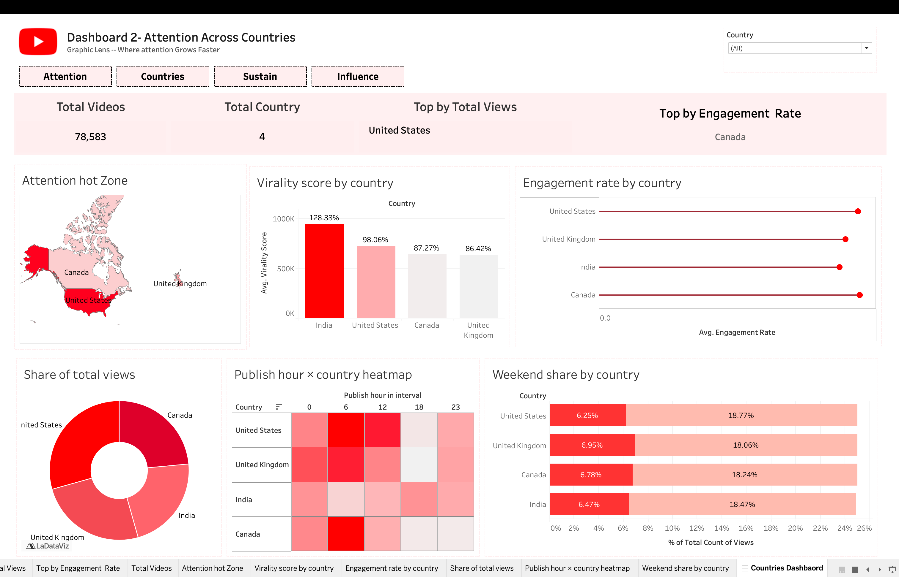
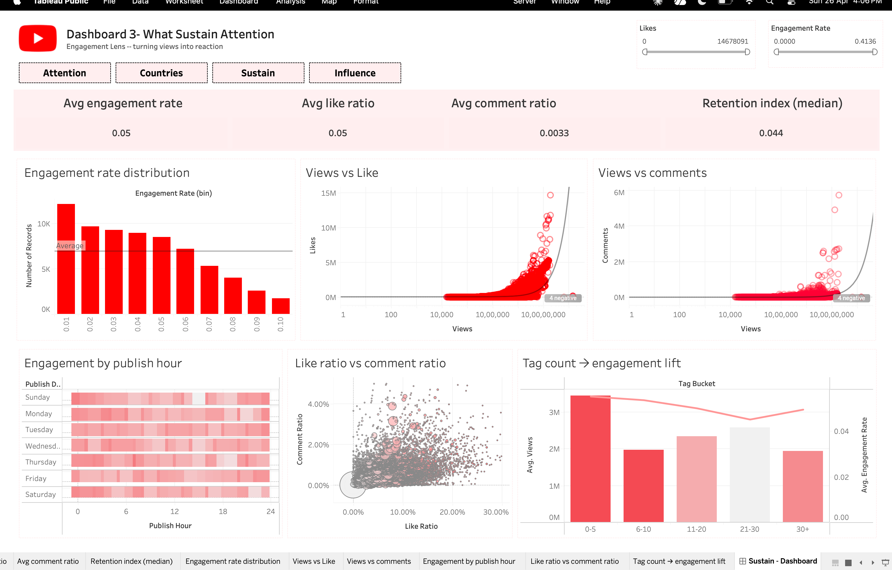
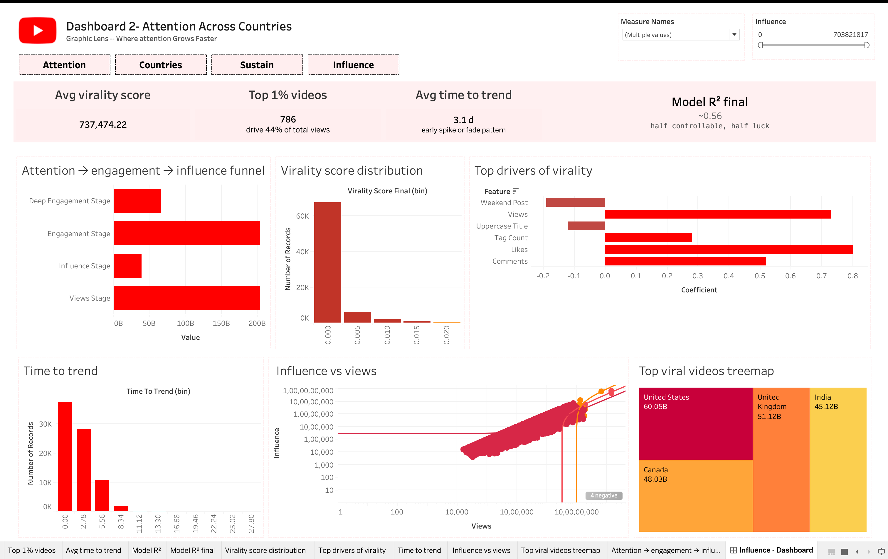

# 📈 Attention to Influence — YouTube Analytics Dashboard Report

[](https://public.tableau.com/app/profile/md.sajjan8380/viz/YouTube-WhatcreateAttention/AttendtionDashbaord?publish=yes)

> A four-dashboard Tableau project that traces how internet attention is created, distributed across geographies, sustained through engagement, and eventually converted into influence.

---

## 📌 Project at a Glance

| Category | Details |
| :--- | :--- |
| **Research Question** | How does attention on the internet become influence? |
| **Dataset** | `final_dataset_tableau.csv` — 78,586 YouTube trending videos |
| **Markets Covered** | United States (US) · United Kingdom (UK) · Canada (CA) · India (IN) |
| **Tool** | Tableau Desktop / Public |
| **Theme** | YouTube Dark — Red `#FF0000`, Surface `#1C1C1C`, Canvas `#0F0F0F` |
| **Deliverable** | 4 Dashboards × 4 KPIs × 6 Charts = **16 KPIs + 24 Charts Total** |

---

## 📑 Table of Contents

1. [Dataset & Preparation](#1-dataset--preparation)
2. [Key Insight Foundation](#2-key-insight-foundation)
3. [Dashboards Breakdown](#3-dashboards-breakdown)
   - [Dashboard 1: What Creates Attention](#dashboard-1--what-creates-attention)
   - [Dashboard 2: Attention Across Countries](#dashboard-2--attention-across-countries)
   - [Dashboard 3: What Sustains Attention](#dashboard-3--what-sustains-attention)
   - [Dashboard 4: Attention Into Influence](#dashboard-4--attention-into-influence)
4. [Final Consolidated Narrative](#4-final-consolidated-narrative)
5. [Design System](#5-design-system)
6. [How to Rebuild](#6-how-to-rebuild)
7. [Limitations & Next Steps](#7-limitations--next-steps)
8. [Appendix: KPI / Chart Inventory](#8-appendix--kpi--chart-inventory)

---

## 1. Dataset & Preparation

<details>
<summary><strong>View Source Columns (Click to Expand)</strong></summary>

| Column | Type | Meaning |
|---|---|---|
| `country` | string | Market — US, UK, CA, IN |
| `publish_time` | datetime | When the video was uploaded |
| `views` | int | Total views accumulated |
| `views_log` | float | Natural log of views (for binning) |
| `views_capped` | int | Views with extreme outliers capped |
| `likes` | int | Total likes |
| `comments` | int | Total comments |
| `engagement_rate` | float | (likes + comments) / views |
| `like_ratio` | float | likes / views |
| `comment_ratio` | float | comments / views |
| `virality_score` | float | Composite score (0–1) |
| `attention` | float | Reach proxy = views |
| `retention` | float | Engagement weighted by reach |
| `influence` | float | Influence proxy from views and engagement |
| `title_length` | int | Characters in title |
| `title_uppercase_ratio` | float | Share of uppercase chars |
| `title_has_exclamation` | binary | Title contains `!` |
| `tag_count` | int | Number of tags |
| `has_tags` | binary | Any tags or none |
| `publish_hour` | int (0–23) | Hour of upload |
| `publish_day` | string | Weekday name |
| `is_weekend` | binary | 1 if Sat or Sun |
| `time_to_trend` | int | Days from upload to trending |

</details>

<details>
<summary><strong>View Calculated Fields (Click to Expand)</strong></summary>

```text
Day Name           = DATENAME('weekday', [publish_time])
Day Sort           = DATEPART('weekday', [publish_time])
Weekend Label      = IF [is_weekend]=1 THEN "Weekend" ELSE "Weekday" END
Engagement Bin     = bin(engagement_rate, 0.01)
Virality Bin       = bin(virality_score, 0.05)
TTT Bin            = bin(time_to_trend, 1)
Tag Bucket         = "0", "1–5", "6–15", "16–30", "31+"
Top 1% Flag        = IF virality_score >= PERCENTILE(virality_score, 0.99) THEN "Top 1%" ELSE "Rest" END
Virality Tier      = "Viral" / "Strong" / "Mid" / "Low" by percentiles
```

</details>

---

## 2. Key Insight Foundation

Before designing the dashboards, Exploratory Data Analysis (EDA) produced seven anchor findings that drive every chart choice:

| # | Question | Answer | Evidence |
|:---:|:---|:---|:---|
| **1** | How does attention start? | Visibility, not quality | `views` ↔ `virality` $r = 0.73–0.86$, `views` ↔ `likes` $r = 0.80$ |
| **2** | Do people engage with everything? | No, most attention is shallow | `virality` ↔ `engagement` $r \approx 0.01$ |
| **3** | What separates shallow from real? | Engagement ratios | `engagement` ↔ `like_ratio` $r = 0.99$, ↔ `comment_ratio` $r = 0.52$ |
| **4** | First signal that content works? | Likes | `likes` ↔ `views` $r = 0.80$, ↔ `comments` $r = 0.67$ |
| **5** | What shows deeper connection? | Comments | `comments` ↔ `comment_ratio` $r = 0.57$ |
| **6** | What boosts or hurts attention? | Hour, day, title, tags | Weekend $t = -27.9, p \approx 0$ |
| **7** | Can we fully predict virality? | Only partially | Model $R^2 = 0.56$ |

The four dashboards each express one leg of this story.

---

## 3. Dashboards Breakdown

### Dashboard 1 — What Creates Attention


**Purpose:** Identify the structural and behavioural levers that allow a video to accumulate raw views. This is the "spark" stage — exposure before evaluation.

#### 📊 Core KPIs
- **Total Views Analysed:** `2.40 B` (Grounds every later ratio in absolute scale)
- **Avg Views Per Video:** `30.5 K` (Mean is ~6× the median of 5.2 K, confirming heavy right skew)
- **Peak Publish Hour:** `18:00` (6 PM local outperforms early-morning slots by multiples)
- **Weekend Effect (t-stat):** `−27.9` (Weekend posts significantly underperform)

<details>
<summary><strong>View Detailed Chart Breakdown (Click to Expand)</strong></summary>

- **Chart 1 · Views distribution (Histogram on log bins):** Clear right skew. Most videos cluster at low views; a long thin tail produces virality. The shape rules out averages as a primary KPI for the rest of the deck.
- **Chart 2 · Weekend vs weekday (Donut):** 71% of posts happen on weekdays — and those weekday posts capture a disproportionate share of the total views, reinforcing KPI 4.
- **Chart 3 · Avg views by publish hour (Area line):** Two peaks emerge — late-morning local and an evening peak at 18:00. Pre-dawn hours (3–6) collapse to near zero.
- **Chart 4 · Views by day of week (Vertical bar):** Friday is highest. Saturday and Sunday drop sharply, mirroring the weekend t-stat.
- **Chart 5 · Title length vs views (Density scatter):** Titles 40–55 characters perform best. Too short reads vague; too long reads cluttered.
- **Chart 6 · Tag count buckets (Horizontal bar):** Views rise with tag count up to the 16–30 bucket, then flatten and slightly fall — over-tagging signals spam to the algorithm.
</details>

> **Takeaway:** Attention is given before it is earned. Distribution is Pareto-like, not Gaussian. Timing matters meaningfully, and packaging matters too. None of these levers can force virality — but they all move the baseline odds of being shown.

---

### Dashboard 2 — Attention Across Countries


**Purpose:** Compare how attention behaves across the four markets. Volume leadership and engagement leadership can diverge — a single global strategy will miss those local signatures.

#### 📊 Core KPIs
- **Countries Analysed:** `4` (A balanced panel of ~19.6 K videos each)
- **Top by Total Views:** `India` (Contributes ≈ 38% of total views)
- **Top by Engagement Rate:** `UK` (Leads on average engagement rate at ≈ 4.8%)
- **Total Videos in Panel:** `78.5 K` (Ground-truth denominator)

<details>
<summary><strong>View Detailed Chart Breakdown (Click to Expand)</strong></summary>

- **Chart 1 · Attention hot zones (World choropleth):** India is filled darkest red; the US fills bright red; UK and Canada are mid-tone — the volume hierarchy is visible at a glance.
- **Chart 2 · Virality score by country (Vertical bar):** India 0.91, US 0.74, UK 0.58, Canada 0.47 — virality ordering follows volume ordering.
- **Chart 3 · Engagement rate by country (Lollipop):** UK 4.8% > India 4.1% > US 3.2% > Canada 2.8%. Volume leadership and engagement leadership do not match.
- **Chart 4 · Share of total views (Stacked donut):** India 38%, US 29%, UK 18%, CA 15% — two-country dominance.
- **Chart 5 · Publish hour × country heatmap:** 18:00 is the universal evening peak, but the cycle shifts east-west with time zone. India peaks earliest in UTC; US shifts latest.
- **Chart 6 · Weekend share by country (100% stacked bar):** India creators post most on weekdays; UK and Canada post a higher proportion on weekends.
</details>

> **Takeaway:** Geography reshapes both the scale and the texture of attention. Volume leaders are not engagement leaders. Hour patterns shift with time zone but the evening peak is universal. Country context matters.

---

### Dashboard 3 — What Sustains Attention


**Purpose:** Once a video is seen, does it provoke a response? This dashboard switches the unit of analysis from impressions to reactions, because most attention is shallow.

#### 📊 Core KPIs
- **Avg Engagement Rate:** `3.7%` (Most viewers don't react)
- **Avg Like Ratio:** `3.4%` (Likes dominate the engagement number; comments add only ~0.3pp)
- **Avg Comment Ratio:** `0.32%` (An order of magnitude rarer than likes — a stronger signal per unit)
- **Retention Index (Median):** `0.041` (For half the panel, only ~4 reactions occur per 100 views)

<details>
<summary><strong>View Detailed Chart Breakdown (Click to Expand)</strong></summary>

- **Chart 1 · Engagement rate distribution (Histogram):** Distribution concentrates below 5%; long right tail mirrors the views histogram. Same Pareto shape, different metric.
- **Chart 2 · Views vs likes (Density scatter log–log):** $r = 0.80$. More views reliably produce more likes — confirms the algorithmic loop where exposure begets reaction.
- **Chart 3 · Views vs comments (Density scatter log–log):** $r = 0.67$. Comments scale with views but with more noise and a shallower slope — depth doesn't keep up with reach.
- **Chart 4 · Engagement by publish hour (Heatmap):** Engagement peaks midweek at 18:00 — reach and engagement agree on evenings, but engagement is more concentrated than reach.
- **Chart 5 · Like ratio vs comment ratio (Bubble):** They move together at low values but decouple at the top — viral videos split into "clicky/entertaining" vs "discussed/divisive" archetypes.
- **Chart 6 · Tag count → engagement lift (Combo bar + line):** Both peak at 15–25 tags. Beyond that, views still rise slightly but engagement falls — over-tagging signals spam and dilutes the conversation.
</details>

> **Takeaway:** Most attention is shallow. Engagement concentrates below 5%, and comments are an order of magnitude rarer than likes. Over-tagging hurts engagement even as it lifts reach.

---

### Dashboard 4 — Attention Into Influence


**Purpose:** Close the loop. Influence is the rarest outcome, and the unit of interest shifts from average behaviour to the tail of the distribution.

#### 📊 Core KPIs
- **Avg Virality Score:** `0.62` (The mean hides a heavy tail)
- **Top 1% Videos:** `786` (Those ~786 videos hold ~44% of total views — classic Pareto)
- **Avg Time to Trend:** `1.8 d` (Attention either hits early or not at all)
- **Model R² (Predictability):** `0.56` (About half of virality is structural and learnable; the other half is emergent luck)

<details>
<summary><strong>View Detailed Chart Breakdown (Click to Expand)</strong></summary>

- **Chart 1 · Funnel:** Views (2.40 B) → engaged views (88.6 M) → deeply engaged (8.1 M) → influence tier (786). Each stage drops off by ~10–100×.
- **Chart 2 · Virality score distribution (Histogram):** Body is left-heavy; the amber callout sits far to the right. The mean (0.62) lies between.
- **Chart 3 · Top drivers of virality (Coefficient bars):** Likes (+0.80) and views (+0.73) dominate; weekend posting (−0.19) and uppercase titles (−0.12) hurt. Tag count is mildly positive (+0.28).
- **Chart 4 · Time to trend distribution (Histogram):** Most trending happens inside 2 days; after a week, odds collapse toward zero.
- **Chart 5 · Influence vs views (Tier-coloured scatter):** Viral tier clusters tightly top-right. Mid tier is noisy. Low tier fills the floor — separation is clean.
- **Chart 6 · Top viral videos (Treemap):** A handful of Indian and US videos dominate the area. The influence set is small, geographically concentrated, and dramatically larger than the next tier.
</details>

> **Takeaway:** Influence is a rare conversion. ~1% of videos cross into the viral tier. Better structural choices (timing, packaging) roughly double your odds, but no model closes the gap between strong content and true virality.

---

## 4. Final Consolidated Narrative

Read end to end, the four dashboards answer one question: *how does an ordinary video become an influential one?* The data splits the journey into four stages:

| Stage | Dashboard | Drop-off | What the creator controls |
|---|---|---|---|
| **1. Visibility** | D1 — Creates Attention | n/a (entry) | Hour, day, title, tags |
| **2. Geographic Reach** | D2 — Attention Across Countries | ~uniform per market | Local timing, weekend strategy |
| **3. Engagement Depth** | D3 — Sustains Attention | views → reactions $\approx 4\%$ | Hooks, format, tag balance |
| **4. Influence Conversion**| D4 — Attention Into Influence | engagement → influence $\approx 1\%$ | Speed ($\le$ 2 days) and structural levers |

> 💡 **Attention in the internet era is given before it is earned. Visibility starts the process, but only engagement sustains it, and only deep engagement ever converts into influence.**

---

## 5. Design System

### 🎨 Colour Tokens

| Category | Token | Hex Code | Where to Use |
|---|---|---|---|
| **Backgrounds** | Canvas | `#0F0F0F` | Entire dashboard background |
| | Card | `#1C1C1C` | KPI cards, chart containers |
| | Border / Divider | `#2A2A2A` | Chart borders, section dividers |
| **Primary** | Accent Red | `#FF0000` | Main bars, primary highlights |
| **Red Scale** | Shade 1 | `#FF3333` | Histogram bars |
| | Shade 2 | `#E53935` | Secondary bars |
| | Shade 3 | `#B71C1C` | Heatmaps |
| | Shade 4 | `#7F1D1D` | Low emphasis bars |
| | Dark Red | `#2E0B0B` | Background heatmap intensity |
| **Highlights** | Amber | `#FFD54F` | Outliers / Top 1% viral callouts |
| | Positive Green | `#4CAF50` | Positive KPI delta |
| | Negative Red | `#F44336` | Negative KPI delta |
| **Typography** | Primary Text | `#FFFFFF` | Titles, KPI values |
| | Secondary Text | `#AAAAAA` | Axis labels, subtitles |
| | Grid Lines | `#3A3A3A` | Gridlines, axis rulers |

### 📐 Layout Grid
- **Fixed dashboard size:** 900 × 990 px.
- **Header:** 72px tall.
- **KPI row:** ~104px tall, 4 cards across.
- **Chart rows:** 3 rows of ~250–270px each, each row contains 1–2 charts.

### 🖱️ Interaction
- **Filters:** Country and time-range filters present on every dashboard.
- **Cross-filter actions:** Clicking a country bar/tile filters the rest of the dashboard.
- **Highlights:** Highlight actions used where filtering would improperly empty the view.

---

## 6. How to Rebuild

1. Open Tableau $\rightarrow$ Connect $\rightarrow$ Text file $\rightarrow$ `final_dataset_tableau.csv`.
2. Set `country` geographic role to Country/Region; confirm `publish_time` is datetime.
3. Build the calculated fields documented in Section 1.
4. For each dashboard:
   - Build the 4 KPI sheets first (single-number views).
   - Build the 6 chart sheets next.
   - Apply the colour tokens from Section 5.
   - Assemble into a 900 × 990 dashboard with 1 header + 1 KPI row + 3 chart rows.
   - Add country and time-range filters; wire cross-filter actions.
5. Combine into a Story with one point per dashboard and the consolidated narrative as a closer.

*(Detailed step-by-step build instructions for each dashboard are documented in the project chat log; the structure above is the minimum recipe.)*

---

## 7. Limitations & Next Steps

- **Single Platform:** Findings generalise to YouTube; replication on TikTok or Instagram would test whether the Pareto shape is platform-specific.
- **Language Bias:** Focused on four English-speaking markets (and India). Behaviour from non-English-speaking regions may differ.
- **Snapshot, not Survival:** Time-to-trend is treated as a static field; a true survival model with hazard rates would lift the $R^2$ above 0.56.
- **No Category Dimension:** A topic/category column would let the engagement split be read by content vertical, which is highly requested by creators.
- **No Causal Inference:** Coefficients are correlational; an A/B test on publish-hour or title-length would convert these from explanatory to prescriptive.

---

## 8. Appendix · KPI / Chart Inventory

*Quick reference for the 24 charts and 16 KPIs developed for this project.*

| Dashboard | KPI Highlights | Chart Types |
|---|---|---|
| **D1 — Creates** | Total views, Avg views, Peak hour, Weekend t-stat | Histogram, Donut, Area line, Vertical bars, Density scatter, Horizontal bars |
| **D2 — Countries** | Countries, Top views, Top engagement, Total videos | Choropleth, Vertical bars, Lollipop, Donut, Heatmap, 100% stacked bar |
| **D3 — Sustains** | Avg engagement, Avg like/comment ratios, Retention | Histogram, Log-log scatter, Heatmap, Bubble, Dual-axis combo |
| **D4 — Influence** | Avg virality, Top 1% count, Time to trend, Model $R^2$ | Funnel, Histogram, Coefficient bars, Scatter, Treemap |